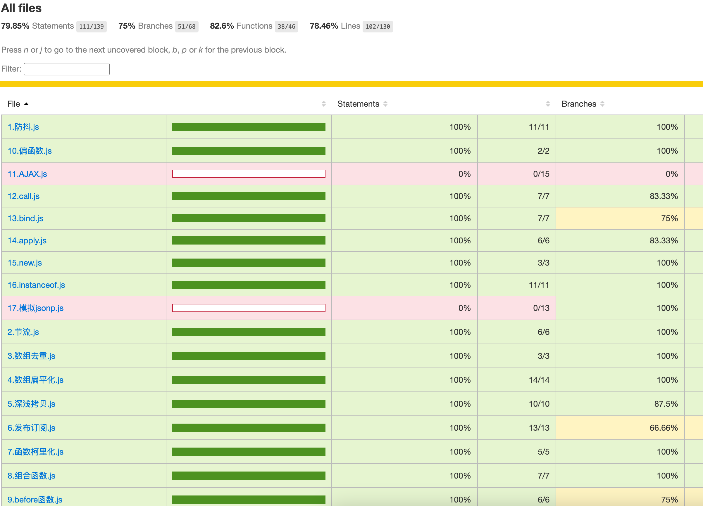

# Javascript常见面试手写题
此文档由`npm run docs` 自动生成  

本仓库通过自动化脚本，每次push会自动跑单测  
**100%单测通过**,每一个方法都使用jest单元测试进行了验证  

后续会持续更新  

## 单测报告
每次push自动生成测试报告  
- [覆盖率](https://www.haoqi123.com/shouxieti/coverage/lcov-report/index.html)
- [单测概览](https://www.haoqi123.com/shouxieti/html-report/index.html)



**函数**
| 题目      | 描述 |
| ----------- | ----------- |
| [1.防抖](#1防抖)      |        |
| [2.节流](#2节流)      |        |
| [5.深浅拷贝](#5深浅拷贝)      |        |
| [6.发布订阅](#6发布订阅)      |        |
| [7.函数柯里化](#7函数柯里化)      |        |
| [8.组合函数](#8组合函数)      |        |
| [9.before函数](#9before函数)      |        |
| [10.偏函数](#10偏函数)      |        |
  

**数组**
| 题目      | 描述 |
| ----------- | ----------- |
| [3.数组去重](#3数组去重)      |        |
| [4.数组扁平化](#4数组扁平化)      |        |
  

**Javascript原理**
| 题目      | 描述 |
| ----------- | ----------- |
| [12.call](#12call)      |        |
| [13.bind](#13bind)      |        |
| [14.apply](#14apply)      |        |
| [15.new](#15new)      |        |
| [16.instanceof](#16instanceof)      |        |
| [17.模拟jsonp](#17模拟jsonp)      |        |
  

**未分类**
| 题目      | 描述 |
| ----------- | ----------- |
| [11.AJAX](#11AJAX)      |        |
  

### [1.防抖](./src/1.防抖.js)
```js
// 1. 防抖
export function debounce(fn, delay, options) {
  let timer = null;
  let shouldInvoke = options.immediately // 是否立即执行
  return function(...args) {
    if (shouldInvoke) {
      fn.call(this, ...args)
      shouldInvoke = false
    }
    if (timer) {
      clearTimeout(timer)
    }
    timer = setTimeout(() => {
      fn.call(this, ...args)
      shouldInvoke = options.immediately
    }, delay)
  }
}
```
  
### [2.节流](./src/2.节流.js)
```js
// 节流函数
export function throttle(fn, delay) {
  let timer = null
  return function (...args) {
    if (!timer) {
      fn.call(this, ...args)
      timer = setTimeout(() => {
        timer = null
      }, delay)
    } 
  }
}
```
  
### [3.数组去重](./src/3.数组去重.js)
```js
export function uniqueArr(arr) {
  return [...new Set(arr)];
}

export function uniqueArr2(arr) {
  return arr.filter((value, index) => arr.indexOf(value) === index);
}

```
  
### [4.数组扁平化](./src/4.数组扁平化.js)
```js
// 根据指定深度递归地将所有子数组元素拼接到新的数组中
// n默认1
export function flat(arr, n) {
  return arr.flat(n)
}

// 全部扁平化
export function flat2(arr) {
  while(arr.some(item => Array.isArray(item))) {
      arr = [].concat(...arr);
  }
  return arr;
}

// 递归法
export function flat3(arr, deep) {
  if (deep === 0) {
    return arr
  }
  let ret = []
  for (let i = 0 ; i < arr.length ; i ++){
    if (Array.isArray(arr[i])) {
      ret.push(...flat3(arr[i], deep - 1))
    } else {
      ret.push(arr[i])
    }
  }
  return ret
}


```
  
### [5.深浅拷贝](./src/5.深浅拷贝.js)
```js
export function deepClone(obj) {
  if (obj === null || typeof obj!== 'object') {
    return obj;
  }
  if (Array.isArray(obj)) {
    return obj.map(item => deepClone(item));
  }
  const clonedObj = {};
  for (const key in obj) {
    if (obj.hasOwnProperty(key)) {
      clonedObj[key] = deepClone(obj[key]);
    }
  }
  return clonedObj;
}
```
  
### [6.发布订阅](./src/6.发布订阅.js)
```js
export class EventEmitter {
  constructor() {
    this.events = {};
  }

  on(eventName, callback) {
    if (!this.events[eventName]) {
      this.events[eventName] = [];
    }
    this.events[eventName].push(callback);
    return this;
  }

  emit(eventName,...args) {
    if (this.events[eventName]) {
      this.events[eventName].forEach(callback => callback(...args));
    }
    return this;
  }

  off(eventName, callback) {
    if (this.events[eventName]) {
      this.events[eventName] = this.events[eventName].filter(
        cb => cb!== callback
      );
    }
    return this;
  }
}

// const emitter = new EventEmitter();

// const callback1 = (data) => {
//   console.log('Callback 1:', data);
// };

// const callback2 = (data) => {
//   console.log('Callback 2:', data);
// };

// emitter.on('event1', callback1);
// emitter.on('event1', callback2);

// emitter.emit('event1', 'Hello from event emitter!');

// emitter.off('event1', callback1);

// emitter.emit('event1', 'Another emit after removing callback1.');
```
  
### [7.函数柯里化](./src/7.函数柯里化.js)
```js
export function curry(func) {
  return function curried(...args) {
    if (args.length >= func.length) {
      return func.apply(this, args);
    } else {
      return function (...nextArgs) {
        return curried.apply(this, [...args,...nextArgs]);
      };
    }
  };
}

```
  
### [8.组合函数](./src/8.组合函数.js)
```js
/**
 * 从右向左执行
 * https://juejin.cn/post/6844903910834962446
 */
export function compose(...fns) {
  if(fns.length === 0) {
    return val => val
  }
  return function(val) {
    fns.reverse().forEach(fn => {
      val = fn(val)
    })
    return val
  }
}
```
  
### [9.before函数](./src/9.before函数.js)
```js
/**
 * 指定函数调用次数
 */
export function before (fn, times) {
  return (...args) => {
    if (times === 0) return
    fn(...args)
    if (times > 0) {
      times-- 
    }
  }
}
```
  
### [10.偏函数](./src/10.偏函数.js)
```js
export function partial(fn, ...arg) {
  return (...args) => {
    return fn(...arg, ...args)
  }
}


```
  
### [11.AJAX](./src/11.AJAX.js)
```js
// get
export function ajaxGet(url, callback) {
  const xhr = new XMLHttpRequest();
  xhr.open('GET', url, true);
  xhr.onreadystatechange = function () {
    if (xhr.readyState === 4 && xhr.status === 200) {
      callback(xhr.responseText);
    }
  };
  xhr.send();
}

// post
export function ajaxPost(url, data, callback) {
  const xhr = new XMLHttpRequest();
  xhr.open('POST', url, true);
  xhr.setRequestHeader('Content-Type', 'application/json');
  xhr.onreadystatechange = function () {
    if (xhr.readyState === 4) {
      if (xhr.status === 200 || xhr.status === 201) {
        callback(xhr.responseText);
      } else {
        console.error('Error in POST request:', xhr.statusText);
      }
    }
  };
  xhr.send(JSON.stringify(data));
}

```
  
### [12.call](./src/12.call.js)
```js
export function call(context, ...args) {
  if (context === null || context === undefined) {
    context = typeof window !== 'undefined' ? window : global
  } else {
    context = Object(context) // 原始值会被包装 如果是非原始值会直接返回
  }
  context.fn = this;
  let ret = context.fn(...args)
  delete context.fn
  return ret
}
```
  
### [13.bind](./src/13.bind.js)
```js
export function bind(context, ...args) {
  if (typeof this !== "function") {
    throw new TypeError("Error");
  }
  let self = this
  let fBound = function (...args2) {
    return self.call(this instanceof self ? this : context, ...args, ...args2)
  }
  fBound.prototype = Object.create(self.prototype)
  return fBound
}
```
  
### [14.apply](./src/14.apply.js)
```js
export function apply (context, argsArray) {
  if (context === null || context === undefined) {
    context = typeof window !== 'undefined' ? window : global
  }
  context.fn = this
  let ret = context.fn(...Array.from(argsArray))
  delete context.fn
  return ret
}
```
  
### [15.new](./src/15.new.js)
```js
export function _new(constructor, ...args) {  
  // let obj = {}                            // 1. 创建一个空对象({})
  // obj.__proto__ = constructor.prototype          // 2. 链接该对象到另外一个对象
  let obj = Object.create(constructor.prototype)    // 替代1 2
  const ret = constructor.call(obj, ...args) // 3. 将创建的空对象作为this的上下文
  return typeof ret === 'object' ? ret : obj // 4. 如果该函数没有返回对象，则返回this
}
```
  
### [16.instanceof](./src/16.instanceof.js)
```js
export function _instanceof(V, F) {
  if (Object.prototype.toString.call(V) !== '[object Object]') {
    return false
  }
  let O = F.prototype
  if (Object.prototype.toString.call(O) !== '[object Object]') {
    return false
  }
  while(true) {
    V = Object.getPrototypeOf(V)
    if (V === null) return false
    if (V === O) return true
  }
}

```
  
### [17.模拟jsonp](./src/17.模拟jsonp.js)
```js
export function jsonp(url) {
  return new Promise((resolve, reject) => {
    // 创建一个唯一的回调函数名
    const uniqueCallbackName = `jsonp_callback_${Date.now()}_${Math.random().toString(36).substring(2)}`;

    // 创建一个 script 标签
    const script = document.createElement('script');
    script.src = `${url}?callback=${uniqueCallbackName}`;

    // 定义全局回调函数
    window[uniqueCallbackName] = function(data) {
      resolve(data);
      // 清除全局回调函数和 script 标签
      delete window[uniqueCallbackName];
      document.body.removeChild(script);
    };

    // 处理错误情况
    script.onerror = function() {
      reject(new Error('JSONP request failed'));
      delete window[uniqueCallbackName];
      document.body.removeChild(script);
    };

    // 将 script 标签添加到文档中
    document.body.appendChild(script);
  });
}
```
  